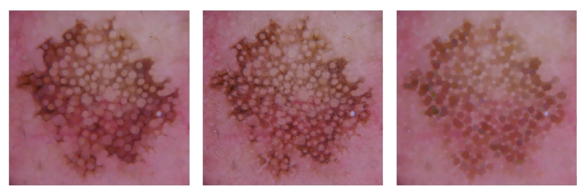

# Soft Color Morphology

Color extension of Mathematical Morphology using Fuzzy Operators to deal with grayscale values.

```
Bibiloni, P., González-Hidalgo, M., & Massanet, S. (2018). 
Soft Color Morphology: A Fuzzy Approach for Multivariate Images. 
Journal of Mathematical Imaging and Vision, 1-17.
```




## Getting Started

Soft color morphology provide two operators, erosion and dilation, that can be combined to form other complex 
mathematical morphology operators. It admits non-binary structuring elements.

To install, type in terminal:
```bash
pip install softcolor
```

To use in natural images, we recommend using the CIELab color space:
```python
import numpy as np
from skimage import data
from softcolor.morphology import MorphologyInCIELab

morphology = MorphologyInCIELab()
structuring_element = np.ones(shape=(5, 1), dtype='float32')

image = data.astronaut()
image_eroded = morphology.erosion(image, structuring_element)
image_dilated = morphology.dilation(image, structuring_element)
```

The soft color morphology operators depend on a fuzzy conjunction and a fuzzy implication function.
They can be provided as:
```python
from skimage import data
from skimage.morphology import disk
from softcolor.morphology import MorphologyInCIELab, soften_structuring_element
from softcolor.aggregation_functions import conjunction_min, implication_godel

morphology = MorphologyInCIELab(
    conjunction=conjunction_min,
    fuzzy_implication_function=implication_godel)
structuring_element = soften_structuring_element(disk(5))

image = data.astronaut()
image_eroded = morphology.opening(image, structuring_element)
image_dilated = morphology.closing(image, structuring_element)
```

Some operations (e.g. top-hat, inpainting) also depend on a measure of dissimilarity between images (such as the 
pixel-wise Euclidean distance) and a method to combine images (such as the standard average).

To apply the soft color operators with generic color spaces, use the class `softcolor.morphology.BaseMorphology`.


### More examples

Browse the [examples folder](examples) to check out other morphological operations.


## License

This project is licensed under the MIT License - see the [LICENSE](LICENSE) file for details.

